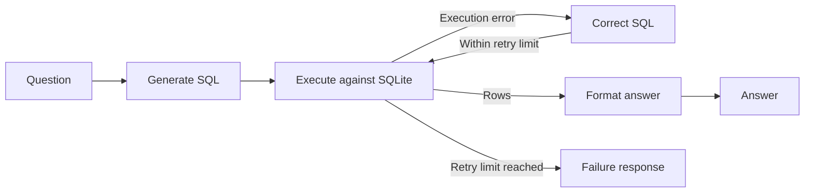

# Self-Correcting Text-to-SQL

A Python application that answers questions about a music-store database using LangGraph, Groq, and SQLite. It generates SQL, executes it against Chinook, and uses database errors to repair failed queries before returning an answer.

The repository includes a Docker runtime, a 60-question evaluation dataset, automated execution scoring, and saved-result reporting.

- **Query workflow:** SQL generation, read-only execution, and up to two correction attempts.
- **Evaluation:** Result comparison against reference SQL, with separate review criteria for ambiguous and unsupported requests.
- **Reporting:** Per-attempt SQL, errors, timing, and category-level metrics in JSON and Markdown.

## Run with Docker

Install Docker with Compose and start Docker Desktop in Linux-container mode on Windows. From the repository root, create `.env` from `.env.example` **only if it does not already exist**, then set `GROQ_API_KEY`.

```powershell
# First-time setup only; preserve an existing .env.
Copy-Item .env.example .env
New-Item -ItemType Directory -Force results
docker compose build
```

On Linux/macOS use `cp .env.example .env` and `mkdir -p results`. If your Linux user/group IDs differ from 1000, set `LOCAL_UID` and `LOCAL_GID` to your IDs before running Compose so the results mount is writable.

The build installs locked dependencies and downloads checksum-verified Chinook v1.4.5. Credentials are supplied at runtime and excluded from the build context. The default model is `llama-3.1-8b-instant`; change `GROQ_MODEL` explicitly when comparing models.

### Ask a question

```powershell
docker compose run --rm app main.py --question "Which 5 customers spent the most?"
```

For an interactive session:

```powershell
docker compose run --rm app
```

The terminal shows node transitions, generated SQL, execution errors, and the final answer. Type `quit` to exit. This is a containerized CLI application, with no web server.

### Run the question bank

Preview all 60 questions without API calls:

```powershell
docker compose run --rm app -m scripts.benchmark_robustness --mode all --list
```

Start with three matched wording variants:

```powershell
docker compose run --rm app -m scripts.benchmark_robustness --family top_customers --output /app/results/customers-run1.json
```

Run the complete bank:

```powershell
docker compose run --rm app -m scripts.benchmark_robustness --mode all --output /app/results/all-run1.json
```

Use `--mode sql` for 36 automatically scored cases, `--mode behavior` for 24 manually reviewed cases, or `--category noisy` for the spelling/fragment slice. Every case starts with fresh state. Live runs make Groq API calls; listing and automated tests do not.

### Inspect the results

The mounted `results/` directory retains outputs after containers exit. Open `results/all-run1.json` in your editor to inspect questions, expected/actual results, SQL attempts, errors, timings, and final answers.

Generate a readable analysis:

```powershell
docker compose run --rm app -m scripts.report_results /app/results/all-run1.json --output /app/results/all-run1.md
```

Open `results/all-run1.md` for accuracy by category, correction rates, behavioral review counts, and failed-case IDs. The report derives observations from saved records without model calls.

For behavioral cases, fill `review.verdict`, `review.reviewer`, and `review.reason` in the JSON using the [rubric](benchmarks/README.md). Regenerate the Markdown to update review counts. SQL and behavioral scores remain separate. Use a new JSON filename for each experiment; the robustness runner refuses to overwrite earlier reports and saves progress after every case.

### Run automated tests

```powershell
docker compose run --rm -e GROQ_API_KEY= app -m pytest -q -p no:cacheprovider
```

Tests use scripted model replies, a small relational fixture, and the bundled Chinook database. They verify software behavior, not live model accuracy. CI builds the image and runs offline tests.

## Architecture



LangGraph controls the workflow. Groq handles SQL generation, correction, and response formatting. SQLite provides the schema, query results, and execution feedback.

The current application runs as a CLI, and benchmark cases execute sequentially. A query that executes successfully but answers the wrong question does not trigger correction; reference-result evaluation identifies that error after the run.

See [architecture and design decisions](docs/architecture.md) for the detailed data flow, technical trade-offs, failure modes, and capacity analysis. [Implementation notes](docs/walkthrough.md) describe state and execution contracts.

## Evaluation

### Dataset and scoring

The [question bank](benchmarks/QUESTIONS.md) contains 12 SQL intent families, each with precise, conversational, and noisy variants (36 prompts), plus 24 diagnostics covering ambiguity, missing context, contradictions, absent data, invalid premises, and read-only restrictions. Full labels, reference SQL, and review criteria are in [question_bank.json](benchmarks/question_bank.json).

These are development and diagnostic data, not a held-out test set. Paraphrases are correlated observations. Report counts and repeated-run variability, keep complete families together when splitting datasets, and use new independently reviewed intent families for future generalization experiments. See the [full protocol](benchmarks/README.md).

| Metric | Definition |
| --- | --- |
| First-try accuracy | Correct first SQL results / SQL questions |
| Final accuracy | Correct final SQL results / SQL questions |
| Self-correction success | Initially SQL-failing questions with correct final results / initially SQL-failing questions |
| Execution recovery | Initially SQL-failing questions that subsequently execute / initially SQL-failing questions |
| Average retry latency | Mean correction-call duration plus subsequent execution duration across completed retry attempts |

Undefined rates are JSON `null` and Markdown N/A. Provider errors remain in overall SQL accuracy denominators. Retry timing excludes initial generation, response formatting, and correction calls that never produce another SQL execution.

SQL scoring compares complete result values by column position, ignoring aliases. Ordered tasks require matching row order; unordered comparisons preserve duplicates. Numeric tolerances are `1e-9` relative and `1e-6` absolute. Natural-language faithfulness is not automatically graded. Ambiguous questions have behavioral criteria rather than arbitrary reference SQL.

### Results

A saved partial run on **2026-09-07** used **`openai/gpt-oss-120b`**, not the default Llama model. Its five completed questions were correct on the first attempt: **5/5 (100%)**. No initial SQL errors occurred, so correction effectiveness and retry latency are **unmeasured**.

This is a small partial run, not a result for the complete 12-question suite or 60-case bank. It does not establish model superiority or generalization. The [pilot analysis](docs/results/pilot.md) and [aggregate evidence](docs/results/pilot-evidence.json) record the observations. No completed 60-case evaluation is claimed.

Future results should identify model, dataset/database hashes, source version, selected cases, and repeated-run protocol.

### Pending experiments

| Experiment | Result | Artifact |
| --- | --- | --- |
| Complete 60-case baseline with reviewed behavioral outcomes | | |
| Repeated-run variability by intent family and wording | | |
| No-repair versus error-feedback repair ablation | | |
| Independent held-out intent families | | |
| Natural-language answer faithfulness | | |

## Runtime constraints

Compose runs as a non-root user with a read-only filesystem, writable results mount, temporary storage, dropped capabilities, and CPU/memory/process limits. SQLite also uses read-only connections, an authorizer permitting read operations, single-statement execution, a cooperative deadline, and a 1,000-row result limit. Formatting previews at most 50 rows.

These controls do not provide per-user data authorization. Questions, schema, repair errors, and result previews are sent to Groq. Reports remain local and are Git-ignored by default; review artifacts before publishing. The [Chinook license](https://github.com/lerocha/chinook-database/blob/master/LICENSE.md) applies to the dataset.

## Local Python alternative

Python 3.10+ source support; local validation uses Python 3.14. Docker also uses Python 3.14.

```powershell
python -m venv .venv
.\.venv\Scripts\python.exe -m pip install -r requirements.txt
.\.venv\Scripts\python.exe scripts/setup_db.py
.\.venv\Scripts\python.exe main.py
.\.venv\Scripts\python.exe -m scripts.benchmark_robustness --mode all --output results/all-run1.json
.\.venv\Scripts\python.exe -m scripts.report_results results/all-run1.json --output results/all-run1.md
.\.venv\Scripts\python.exe -m pytest -q
```

On Linux/macOS use `.venv/bin/python`. Configure `.env` as above. Entry points use UTF-8 console output. Direct dependencies are pinned in `requirements.txt`; `requirements-lock.txt` pins transitive versions. The Docker base tag is not digest-pinned, so a rebuild may select a newer base-image patch.

Docker commands follow the [Compose one-off command documentation](https://docs.docker.com/reference/cli/docker/compose/run/). Primary implementation references: [LangGraph](https://docs.langchain.com/oss/python/langgraph/graph-api), [ChatGroq](https://docs.langchain.com/oss/python/integrations/chat/groq), and [sqlite3](https://docs.python.org/3/library/sqlite3.html).

## Planned work

- Complete repeated evaluations across the question bank and review behavioral outcomes.
- Compare generation without repair, regeneration, and execution-feedback repair.
- Add per-stage latency and token-usage measurements.
- Implement and evaluate clarification for ambiguous questions.
- Extend evaluation to held-out intent families and additional schemas.
