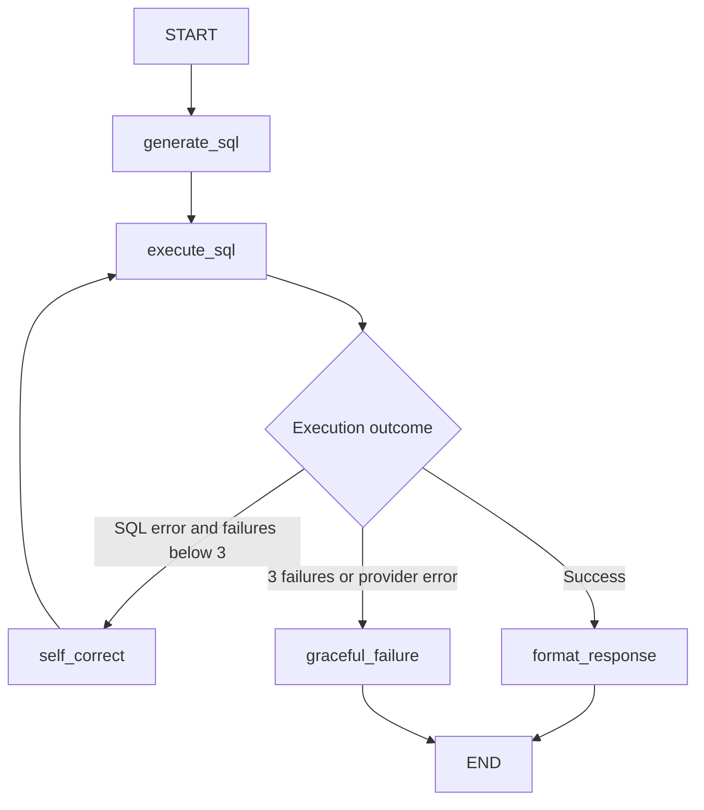

# Self-Correcting Text-to-SQL Agent

A Python application that turns a question about the Chinook music store into SQLite SQL, executes it, and uses database error feedback to repair failed queries. LangGraph makes the control flow explicit; Groq supplies `llama-3.1-8b-instant`.

This is an interview-ready reference implementation with operational safeguards and deterministic tests. It is a local CLI, not a deployed multi-tenant service. Live model accuracy must be measured with your API key; passing scripted tests is not evidence of model quality.

## Run on Windows

Python 3.10+ is required. From this repository's root in PowerShell:

```powershell
python -m venv .venv
.\.venv\Scripts\python.exe -m pip install -r requirements.txt
.\.venv\Scripts\python.exe scripts/setup_db.py
Copy-Item .env.example .env
```

Edit `.env` and supply your Groq API key. Do not commit it. Run:

```powershell
.\.venv\Scripts\python.exe -m pytest -q
.\.venv\Scripts\python.exe main.py
.\.venv\Scripts\python.exe main.py --question "Which 5 customers spent the most?"
.\.venv\Scripts\python.exe -m scripts.benchmark
```

Virtual environment activation is optional, so these commands also work when PowerShell blocks activation scripts. On macOS/Linux, replace `.\.venv\Scripts\python.exe` with `.venv/bin/python`. CLI entry points configure stdout/stderr for UTF-8; JSON and dotenv files use UTF-8. Console fonts still determine which glyphs can be displayed.

The setup script downloads Chinook v1.4.5 over HTTPS, checks a pinned SHA-256, validates SQLite integrity and table names, and installs through a temporary file. Existing databases are validated and preserved. `DATABASE_PATH` is resolved relative to the repository unless absolute; `--path` overrides the setup destination. The database is excluded from Git. Chinook's upstream [license](https://github.com/lerocha/chinook-database/blob/master/LICENSE.md) applies to the sample database.

Direct dependencies are pinned in `requirements.txt`. `requirements-lock.txt` records the complete environment used for validation on Windows/Python 3.14; use `pip install -r requirements-lock.txt` to reproduce those versions. For other Python versions, start with `requirements.txt`. The source and direct dependencies support Python 3.10+, but only the available Python 3.14 runtime was tested locally.

## Repository map

```text
text_to_sql/
├── .env.example
├── README.md
├── requirements.txt
├── requirements-lock.txt
├── pytest.ini
├── main.py
├── scripts/
│   ├── setup_db.py
│   └── benchmark.py
├── src/
│   ├── __init__.py
│   ├── config.py
│   ├── database.py
│   ├── evaluation.py
│   └── agent/
│       ├── __init__.py
│       ├── state.py
│       ├── nodes.py
│       ├── edges.py
│       └── graph.py
├── tests/
│   ├── conftest.py
│   ├── test_dataset.json
│   ├── test_database.py
│   └── test_eval.py
└── docs/
    └── walkthrough.md
```

## Graph and retry contract



`retry_count` counts failed SQL executions, following the requested contract. Thus the maximum is **three executions: one initial attempt and two corrections**. On a successful second execution the counter stays at 1. The error is cleared on success. Empty results count as success. Provider errors terminate separately and do not increment the SQL counter. `execute_sql` immediately returns when a provider error is present, allowing the same router to handle that path.

Nodes return partial state dictionaries; LangGraph replaces only the supplied keys. No reducer is needed because each step has one writer and attempt history is explicitly replaced with a new list. The explicit retry bound terminates the cycle; the separate graph recursion limit of 20 is a backstop. There is no checkpoint persistence between CLI questions.

## Evaluation you can defend

For wording robustness and ambiguity diagnostics, use the additional [60-case question bank](benchmarks/QUESTIONS.md) and its [benchmark protocol](benchmarks/README.md). It includes precise, conversational, and typo-heavy versions of the same SQL intents, plus manually reviewed ambiguous and unsupported requests. Run `python -m scripts.benchmark_robustness --mode all --list` to preview without API calls.

`tests/test_dataset.json` contains 12 questions with explicit output columns, sorting rules, tie breakers, and ground-truth SQL. Topics include multi-table joins, `GROUP BY`, `HAVING`, a CTE, correlated `NOT EXISTS`, and left joins preserving empty playlists. Reference SQL runs against the same database as agent SQL.

Scoring compares result values by column position, ignoring column aliases. Ordered cases require identical row order. Unordered cases preserve duplicate multiplicity. Numeric comparison uses relative tolerance `1e-9` and absolute tolerance `1e-6`; strings and NULL remain distinct. Empty results also require equal column counts. The complete bounded result is scored, never the natural-language summary.

| Metric | Definition |
| --- | --- |
| First-try accuracy | Correct first execution results / all questions |
| Final accuracy | Correct final execution results / all questions |
| Self-correction success rate | Initially SQL-failing questions with correct final results / initially SQL-failing questions |
| Execution recovery rate | Initially SQL-failing questions that later execute / initially SQL-failing questions |
| Average retry latency | Mean of correction model call + subsequent SQL execution, across completed retry attempts |

Zero denominators produce JSON `null`, not an invented percentage. Retry latency includes completed unsuccessful retries and provider SDK retry time inside successful model calls. It excludes initial generation, initial execution, response formatting, and correction calls that fail before producing another SQL execution. Provider failures are recorded separately; all questions remain in overall accuracy denominators.

Default pytest tests use a small local fixture with independently calculated answers and scripted model replies. They exercise the real compiled graph with zero Groq calls. If `chinook.db` exists, one additional integration test executes every golden query on the downloaded release. The benchmark is an explicit live run: it calls Groq, saves each attempt, and records model/package versions plus dataset/database hashes in `benchmark-results.json`. Temperature zero reduces variation but does not guarantee deterministic API output.

SQL that executes yet answers the wrong question does **not** enter the correction loop. Evaluation detects that mismatch after the graph finishes. The formatter is not a judge, and the agent never receives golden SQL during a live benchmark.

## Operational boundaries

SQLite opens a fresh read-only connection per execution. A SQLite authorizer allowlists read operations and blocks writes, attachment, transactions, pragmas, and extension/file helper functions. `execute()` accepts one statement. A progress handler limits query computation, SQL text is bounded, and results exceeding 1,000 rows fail explicitly rather than silently truncating the benchmark. The formatter receives at most 50 rows and discloses previews. Connections are explicitly closed, including on exceptions.

These controls are suitable for a local sample database. A SQLite progress handler is cooperative, not a hard process CPU/memory limit; a single large value can still consume substantial memory. Before exposing arbitrary SQL publicly, add process/container resource isolation, authentication, per-user data authorization, concurrency and rate limits, secret management, and service monitoring. Read-only access alone does not restrict which rows a user may read.

Questions, schema, failed SQL/error tracebacks, and result previews are sent to Groq. Benchmark reports retain SQL and results locally. Use this configuration with the public sample data; design redaction and access controls before adapting it to private datasets. Prompt instructions help keep output focused, while the database boundary enforces write restrictions. Natural-language summaries may still misstate facts and are not scored by the execution evaluator.

## Study and explain it

Start with [the guided walkthrough](docs/walkthrough.md). Read `state.py`, trace `edges.py`, then inspect `nodes.py` and `graph.py`. Run a single scripted repair test and predict each state update before reading its assertions:

```powershell
.\.venv\Scripts\python.exe -m pytest tests/test_eval.py -k streamed_cycle -v
```

Then review evaluation denominators and demonstrate a valid-but-wrong query. That distinction is central to explaining the project's strengths and limits in an interview.

Primary references: [LangGraph graph API](https://docs.langchain.com/oss/python/langgraph/graph-api), [ChatGroq integration](https://docs.langchain.com/oss/python/integrations/chat/groq), [Groq model documentation](https://console.groq.com/docs/model/llama-3.1-8b-instant), [Python sqlite3](https://docs.python.org/3/library/sqlite3.html), and [Chinook release](https://github.com/lerocha/chinook-database/releases/tag/v1.4.5).
