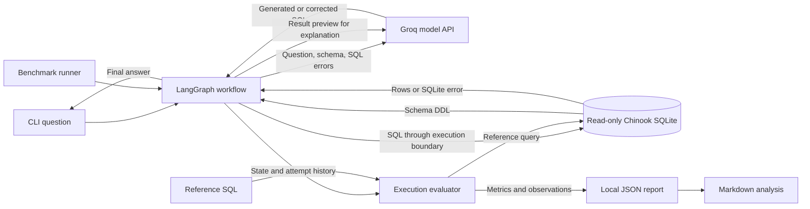
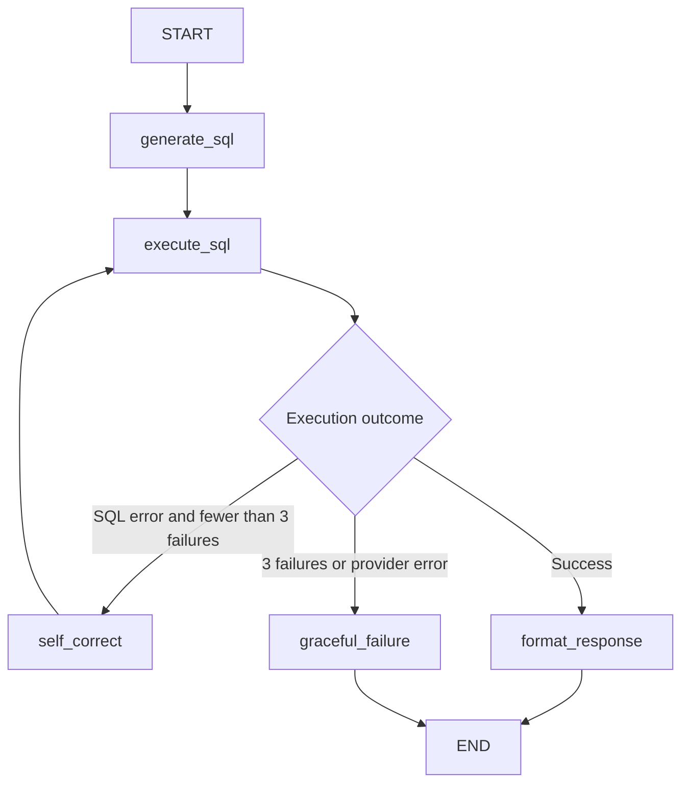

# Architecture and design decisions

This document records the current implementation, its trade-offs, and capacity questions that remain unmeasured.

## Architecture

### Data flow

Reference SQL is used only by the evaluator. It is never included in generation or correction prompts. Behavioral cases bypass automatic SQL scoring and retain human-review criteria.

### State transitions

`retry_count` counts failed SQL executions. The limit is one initial execution plus at most two corrections. Empty results are successful executions. Provider errors terminate separately; formatting failure preserves the SQL result. An executable but semantically incorrect query does not enter the repair loop.

| Component | Responsibility | Implementation |
| --- | --- | --- |
| Entrypoints | Interactive queries and sequential experiment runs | [main.py](main.py), [benchmark runner](scripts/benchmark_robustness.py) |
| Orchestration | Typed state, transitions, bounded cycle | [src/agent/](src/agent/) |
| Model integration | Configuration, timeout, transport retries | [src/config.py](src/config.py) |
| Execution boundary | Read-only access, authorization, result and query limits | [src/database.py](src/database.py) |
| Evaluation | Reference execution and result comparison | [src/evaluation.py](src/evaluation.py) |
| Reporting | Recompute metrics and summarize saved reviews | [scripts/report_results.py](scripts/report_results.py) |

## Technical Trade-offs

These decisions describe the implemented baseline. Revisit conditions identify evidence that would justify changing it; they are not implemented features.

| Decision | Rationale and alternative considered | Consequence | Revisit when |
| --- | --- | --- | --- |
| LangGraph rather than an application-level retry loop | Explicit state transitions expose the repair cycle and produce node-level stream events. A plain loop would have fewer dependencies. | Additional state contracts and dependency maintenance; the graph does not itself ensure SQL correctness. | Orchestration overhead becomes material, or workflow requirements simplify. |
| SQLite rather than a separate PostgreSQL service | A checksum-verified file provides a fixed experimental dataset with no database-service setup. | Queries run in the application process, sharing its CPU and memory; no server-side workload isolation. | Workloads require shared mutable data, centralized access control, or measured database concurrency beyond this model. |
| Preserve Chinook's relational representation rather than denormalize into documents | Explicit keys and relationships expose joins and aggregation semantics, which are central to the experiment. | Schema interpretation and join selection remain model failure modes. Read-only access does not establish that imported data are valid. | The research question changes to document retrieval or another data model. |
| Execution-error repair rather than an LLM-only critique | SQLite supplies a concrete error signal; reference-result evaluation measures whether the correction actually helps. | Executable semantic mistakes are invisible to runtime routing. | An independently evaluated semantic validator improves accuracy enough to justify its cost. |
| Three execution attempts rather than unbounded repair | The cap bounds repeated SQL failures and associated model calls. | Some recoverable cases may terminate early. The threshold is a baseline parameter, not an experimentally established optimum. | An attempt-budget ablation quantifies marginal recovery versus latency and cost. |
| Full schema prompts rather than schema retrieval | The fixed Chinook schema can be supplied directly, avoiding retrieval as a confounding variable. | Repeated schema tokens add overhead; large schemas may exceed a practical prompt budget. | Larger-schema experiments establish retrieval recall and end-to-end correctness. |
| Serial execution without Redis or a job queue | A sequential baseline avoids shared scheduling and cache effects during initial experiments. | No global admission control, shared quota coordination, or horizontal scheduling. | A service workload and provider-budget model are defined. |
| Local JSON artifacts rather than a results service | Saved attempts and metadata support inspection without another service. | Entire accumulated reports are rewritten after each case; storage and concurrency are limited. | Experiment volume or concurrent writers require append-only records or transactional persistence. |

## Failure Modes & Bottlenecks

| Failure mode | Current behavior | Residual limitation |
| --- | --- | --- |
| Invalid SQL or schema reference | SQLite traceback feeds bounded correction. | Repeated corrections may fail or alter the intended meaning. |
| Executable but incorrect SQL | Execution succeeds and the formatter runs. | Only offline reference comparison detects the mismatch. |
| Ambiguous or unsupported question | Follows the same generation path. | No dedicated clarification stage or explicit answerability decision. |
| Provider timeout, rate limit, or outage | Client timeout is 30 seconds with up to two configured transport retries; generation/repair failures terminate. | This is not a whole-request deadline. SDK retries and graph retries can amplify load. |
| Large result or expensive query | Two-second cooperative SQLite deadline, 20,000-character SQL limit, and 1,000-row result cap. | Row count is not a byte limit; large cells and intermediate operations can still consume memory. |
| Formatting failure or inaccurate prose | Provider failure falls back to a result preview; normal formatting sees at most 50 rows. | Generated explanations can misstate values; their faithfulness is not execution-scored. |
| Interrupted benchmark | Completed cases are saved after each question using temporary-file replacement. | In-flight work is lost, there is no resume mechanism, and a single output path is not safe for concurrent writers. |
| Untrusted write request | Read-only connections and a SQLite authorizer block modifications. | Database containment does not guarantee a useful refusal or per-user data authorization. |

## Capacity analysis

**This is an untested capacity scenario, not an observed load-test result.** The current CLI has no user-facing listener or request scheduler. Its benchmark runner processes one case at a time. Serving 10,000 concurrent users would first require a service interface and an explicit workload definition.

If independent requests were admitted concurrently through a future service wrapper, the expected pressure points would be:

1. **Provider demand and retry amplification.** A nonempty first-attempt success uses two logical model calls: generation and formatting. A success after two SQL corrections uses four. Under those assumptions, 10,000 simultaneous questions would create demand for 20,000–40,000 logical calls over their lifetimes, before eligible SDK retries. Provider throughput, latency, and quota limits would need measurement; there is no shared limiter or circuit breaker today.
2. **Blocking request lifetime.** Model calls and SQL execution are synchronous. A wrapper that creates a thread or process per request would retain resources while waiting on the provider. No application-level admission limit or end-to-end deadline controls that accumulation. A bounded worker pool and backpressure would be design candidates, not guaranteed fixes.
3. **In-process database work.** Each SQL execution opens and closes a connection; there is no connection pool to saturate. Concurrent scans and joins would compete for CPU, filesystem access, and memory. The experiment is read-only, so attributing its primary bottleneck to SQLite write-lock contention would be unsupported.
4. **Memory retention and container limits.** State retains SQL, results, and error history, while the benchmark retains all completed records. Memory therefore grows with concurrent work and retained artifacts even without a leak. The current Compose service has a 1 GiB memory limit, two-CPU quota, and 128-PID limit; it can throttle, fail to create additional workers, or be terminated before that hypothetical load is reached. No memory leak has been established.
5. **Report storage.** Repeated serialization of a growing report increases cumulative write work. Two writers targeting the same JSON and temporary-file path can interfere. Per-run output isolation and transactional or append-only storage would be needed for concurrent experiments.

For capacity planning, define arrival rate, request mix, model, token sizes, retry distribution, and latency objectives first. Under steady-state assumptions, Little's law relates in-flight work to throughput and mean request time: **L = λW**. User count alone does not specify requests per second.

### Capacity measurements

Blank entries below are intentionally unmeasured. They are not zeroes or targets.

| Measurement | Value | Test conditions / artifact |
| --- | --- | --- |
| Sustainable requests per second | | |
| p50 / p95 / p99 end-to-end latency | | |
| Peak resident memory versus in-flight requests | | |
| Provider throttling and timeout rate | | |
| Queue wait time and rejected requests | | |
| Cost per correctly answered question | | |
| Long-running memory-retention profile | | |
